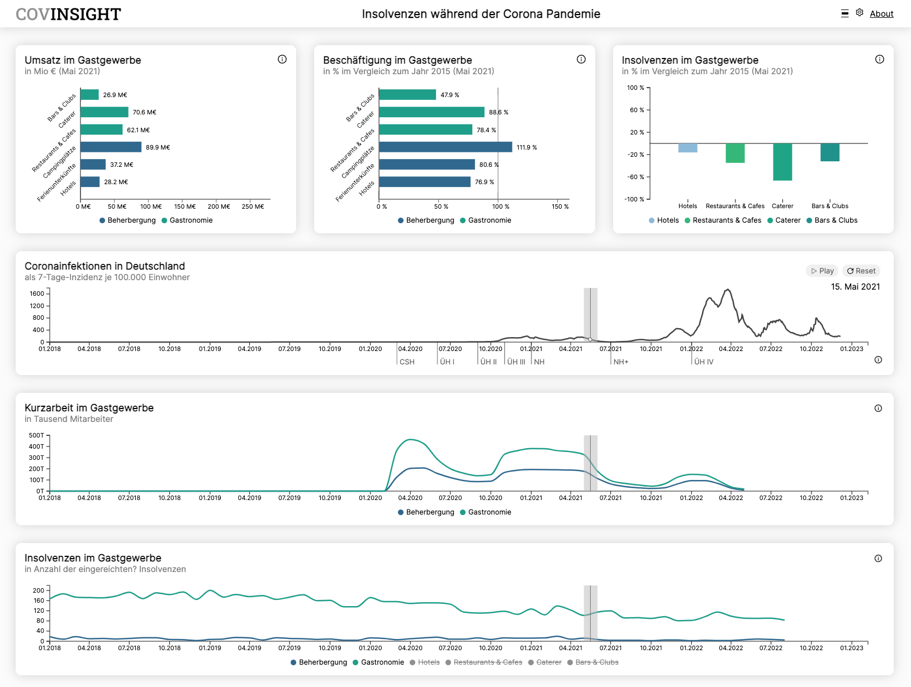
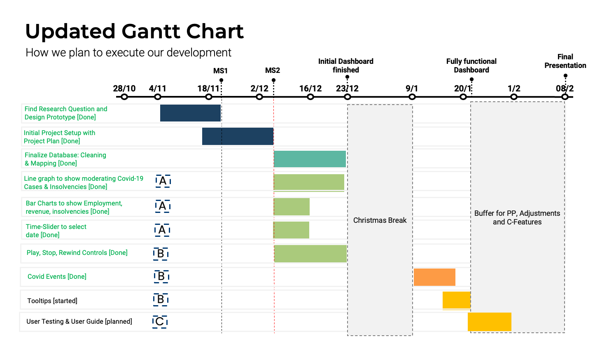

<!-- PROJECT LOGO -->
<a name="readme-top"></a>
<div align="center">

  <a href="https://github.com/InfoVis22/CovInsights/tree/main"></a>

  <h3 align="center">Informationvisualisation WS22/23</h3>

  <p align="center">
    A project to visualize datasets of the german gastronomy industry in relation to the global COVID-19 pandemic.
  </p>
</div>


<!-- ABOUT THE PROJECT -->
## About The Project
This project is done as part of the lecture Data Visualization (DataVis) at the LMU Munich. Our goal is to visualize the effects of the COVID pandemic on the german gastronomy industry with respect to revenue, employment, insolvency, turnover and subventions.

![React.js] ![D3_logo]


<!-- DEMO -->
### Demo Application
See the Demo: [CovInsight Demo](https://covinsight.mmt-lmu.de/) ✅





<!-- Installation -->
### Installation
To run this application node.js and npm is required.

Run `npm install` to install the packages specified in the dependencies

<!-- Usage -->
### Usage
Run the following commands to start the app locally
```
npm run dev
npm run build and open the index.html
npm run preview
```


<!-- Features -->
## Feature list

### Visualizations: Bar Graphs
- [x] Employment as Bar chart
- [x] Revenue as Bar chart
- [x] Change in bankruptcies as Bar chart 


### Visualizations: Bar Graphs
- [x] COV19 7-Day-Incidencies
- [x] Short time work
- [x] Bankrupt businesses

### Main Interactions
- [x] Synchronized cursors on all timelines
- [x] Auto Play / Pause and Reset
- [x] Important events on timeline

### Additional interactions
- [x] Tooltips on hover
- [x] Responsive Design
- [x] Settings menu to change overall timeframe
- [x] Chart explanation behind info icons
- [x] Interactive legend: hide/unhide sectors
- [x] Toggle between alternative Layout 
- [x] Interactive User guide / Tutorial
- [x] Keyboard Shortcuts

### Pages
- [x] Dashboard (6 visuals)
- [x] About (incl. Sources & Gantt Chart)


<!-- ROADMAP -->
## Roadmap




<!-- CONTACT -->
## Contributors
Alexander Welling - j.welling@campus.lmu.de <br/>
Lennard Greve - l.greve@campus.lmu.de <br/>
Sofie Henghuber - sofie.henghuber@campus.lmu.de <br/>
Manuel Totzauer - m.totzauer@campus.lmu.de <br/>
Maximilian Brandmaier - m.brandmaier@campus.lmu.de


<!-- MARKDOWN LINKS & IMAGES -->
<!-- https://www.markdownguide.org/basic-syntax/#reference-style-links -->
[React.js]: https://img.shields.io/badge/React-20232A?style=for-the-badge&logo=react&logoColor=61DAFB
[D3_logo]: https://camo.githubusercontent.com/67c208d052be83838e7481b47cc2fcf47b9e1faf527aed94f109876212cbab72/68747470733a2f2f696d672e736869656c64732e696f2f7374617469632f76313f7374796c653d666f722d7468652d6261646765266d6573736167653d44332e6a7326636f6c6f723d323232323232266c6f676f3d44332e6a73266c6f676f436f6c6f723d463941303343266c6162656c3d
[React-url]: https://reactjs.org/