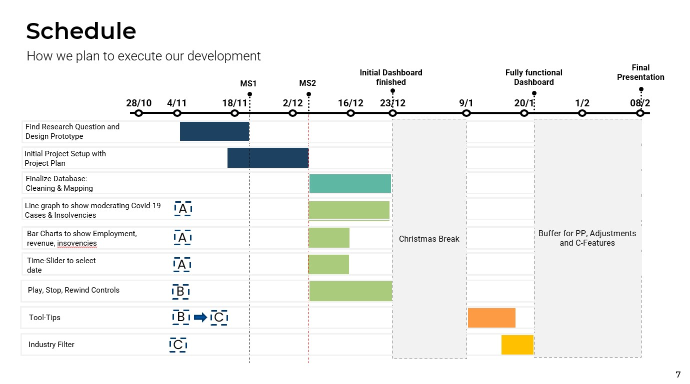

<!-- PROJECT LOGO -->

  

  <h3 align="center">CovInsights WS22/23</h3>

  

    A project to visualize datasets of the germans gastronomy industry in relation to corona incidences
     
    <a href="https://github.com/InfoVis22/CovInsights"><strong>GitHub Repo »</strong></a>
     
     
    <a href="https://covinsight.mmt-lmu.de/">View Demo</a>
    ·
    <a href="https://github.com/InfoVis22/CovInsights/issues">Report Bug</a>
    ·
    <a href="https://github.com/InfoVis22/CovInsights/issues">Request Feature</a>
  

<!-- TABLE OF CONTENTS -->

  
Table of Contents

  <ol>
    <li>
      <a href="#about-the-project">About The Project</a>
      <ul>
        <li><a href="#built-with">Built With</a></li>
      </ul>
    </li>
    <li>
      <a href="#getting-started">Getting Started</a>
      <ul>
        <li><a href="#prerequisites">Prerequisites</a></li>
        <li><a href="#installation">Installation</a></li>
      </ul>
    </li>
    <li><a href="#usage">Usage</a></li>
    <li><a href="#roadmap">Roadmap</a></li>
    <li><a href="#contributing">Contributing</a></li>
    <li><a href="#license">License</a></li>
    <li><a href="#contact">Contact</a></li>
    <li><a href="#acknowledgments">Acknowledgments</a></li>
  </ol>

<!-- ABOUT THE PROJECT -->
## About The Project
This project is done as part of the lecture Data Visualization (DataVis) at the LMU Munich. Our goal is to visualize the effects of the covid pandemic on the german gastronomy industry with respect to insolvency, turnover and subventions.

<!-- GETTING STARTED -->
## Getting Started

### Demo Application

See the Demo: [Dashboard Demo](https://covinsight.mmt-lmu.de/)

### Installation
To run this application node.js and npm is required.
node.js can be downloaded here -> https://nodejs.org/en/download/
The installer also contains the npm package manager.
Run npm install to install the packages specified in the dependencies

### Usage
Run one of the following commands to start the app
- npm run dev
- npm run build
- npm run preview

<!-- ROADMAP -->
## Roadmap

### Overview

### Done Features
- [x] Find Research Question
- [x] Setup Projektmanagement/ Task Distribution in Asana
- [x] Create Paper Prototype
- [x] Setup Technical Infrastructure
- [x] Create First Structure of the Dashboard
- [x] Create About Us Page
- [x] Prioritize Features
- [x] Create Gantt
- [x] Create time slider to select time
- [x] Implement play, stop and rewind controls

### In Progress Features
- [ ] Finalize Database Cleaning & Mapping
- [ ] Create line grapth to show Covid Cases
- [ ] Create bar charts for employment, revenue and insovencies

### Backlog Features

- [ ] Use accessibility colors (https://coolors.co/b5c2b7-8c93a8-62466b-45364b-2d2327)
- [ ] Implement tooltips
- [ ] Implement industry filter

<!-- CONTACT -->
## Contact
Alexander Welling - j.welling@campus.lmu.de  
Lennard Greve - l.greve@campus.lmu.de  
Sofie Henghuber - sofie.henghuber@campus.lmu.de  
Manuel Totzauer - m.totzauer@campus.lmu.de  
Maximilian Brandmaier - m.brandmaier@campus.lmu.de

(<a href="#readme-top">back to top</a>)

<!-- ACKNOWLEDGMENTS -->
## Acknowledgments
* [React Icons](https://react-icons.github.io/react-icons/search)
  

(<a href="#readme-top">back to top</a>)

<!-- MARKDOWN LINKS & IMAGES -->
<!-- https://www.markdownguide.org/basic-syntax/#reference-style-links -->
[React.js]: https://img.shields.io/badge/React-20232A?style=for-the-badge&logo=react&logoColor=61DAFB
[React-url]: https://reactjs.org/